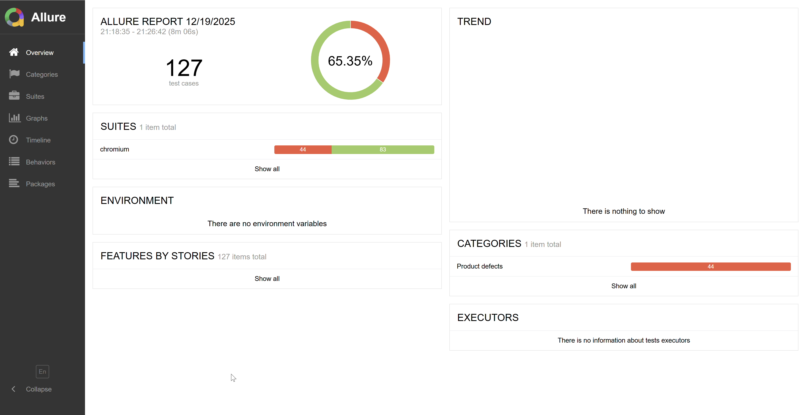

# Introduction
This repository contains end-to-end tests for a movie ticket platform, built with **[Playwright](https://playwright.dev/)**. The tests follow best practices such as the Page Object Model (POM) for scalable test code.

## Tech Stack And Libraries
These repository tests leverage the following technologies and libraries:
- [Playwright](https://playwright.dev/) — Modern end-to-end browser automation and testing library supporting Chromium, Firefox, and WebKit.
- [Node.js](https://nodejs.org/) — JavaScript runtime environment for running tests and scripts.
- [Allure](https://docs.qameta.io/allure/) — Flexible and powerful test reporting tool for generating visual test reports.

## Key test features

- End-to-end, functional, and data display test support
- Page Object Model structure
- Allure reporting integration
- Parallel test execution
- Cross-browser testing (Chromium, Firefox, WebKit)
- Environment variable support via dotenv

## Project Structure
```
api/                   # Functions, Types to fetch and transform API data 
  ├── cinemas/         # Cinema domain     
  ├── movies/          # Movie domain
  ├── showtimes/       # Showtime and Ticketing domain 
  └── users/           # User Account domain
fixtures/              # Custom Playwright Page fixtures 
pages/                 # Page Object Model classes
  └── components/      # Reusable UI components (e.g., navigation bar, dropdowns, tabs)
  └── BasePage.ts      # Reusable actions and locators for all pages
  └── BaseForm.ts      # Reusable actions and locators for all forms (e.g., login, register, account)
  └── LoginPage.ts     # Page class
  └── ...
tests/                 # All test files and helpers
  ├── auth/            # Test specs for authentication    
  ├── ...              # Other feature-based test folders (e.g., booking, account update)
  ├── e2e/             # End-to-end user journey tests
  ├── responsive/      # Responsive tests
  ├── test-data/       # Static data for test (e.g., validation rules, test users)
  ├── utils/           # Test helpers, data generators, routes and regex
allure-report/         # Generated Allure HTML reports (after running tests)
allure-results/        # Raw results for Allure reporting
playwright.config.ts   # Playwright configuration file
package.json           # Project dependencies and npm scripts
tsconfig.json          # Configuration for compiler to transform .ts into .js
merge.config.ts        # Config for the merge step in CI for sharding to speed up runs
.env                   # Environment variables (e.g., BASE_URL)
```

## Test Data Strategy

Due to a lack of backend access and data seeding capabilities, tests dynamically discover eligible test data via public APIs. This ensures correctness in a shared, mutable environment but increases execution time.

In a controlled test environment, these tests would instead:
- Create required data via API
- Use seeded fixtures
- Reset state between tests
- Remove dynamic discovery logic

<br>

# Getting Started


## Prerequisites
- Node.js (latest 20.x, 22.x or 24.x)
- npm (v9+ recommended) - _already included when installing Node.js_ 


## Setup
To get started with the tests:

1. **Clone the repository**

	```bash
	git clone https://github.com/trang-le298/demo01-playwright-framework.git
	cd demo01-playwright-framework  
	```

2. **Install dependencies**

	```bash
	npm install
	```

## Configuration
- Edit `playwright.config.ts` for test settings, reporters, and browser options.
- Create a `.env` file in the project root to set environment-specific values. Example:

```
BASE_URL=https://demo1.cybersoft.edu.vn/
```

The `BASE_URL` will be used as the base URL for all Playwright tests. You can change this value to test against different environments.


## Add New Tests

### Page Object Model (POM) 

This project uses the Page Object Model (POM) pattern to keep test code maintainable and reusable. The main concepts are:

- **Pages**: Represent full application pages (e.g., `LoginPage`, `HomePage`, `AccountPage`). Each page class contains selectors and methods for interacting with that page.
- **Components**: Represent reusable UI parts that can appear on multiple pages (e.g., form fields, navigation bars). Components are usually placed in the `pages/components/` folder and can be used by page classes.
- **BasePage**: An abstract class with common methods and utilities shared by all page classes (e.g., navigation, waiting for elements).

Refer to the Project Structure above to determine the location for your new tests.

**Example usage:**

```typescript
// pages/BasePage.ts
export abstract class BasePage {
    readonly page: Page;
    constructor(page: Page) {
        this.page = page;
    }
    async navigateToPage(url: string) {
        await this.page.goto(url);
        await expect(this.page).toHaveURL(url);
    }
}

// pages/LoginPage.ts
import { BasePage } from './BasePage';

export class LoginPage extends BasePage {
	async navigateToLoginPage(url: string) {
		await this.navigateToPage(url);
	}
}

```

This structure helps you keep your tests DRY (Don’t Repeat Yourself) and easy to extend as your application grows.


### Test Organization

Use `test.describe` to group related tests together, making your test output more organized and readable:

```typescript
test.describe('Login Functional Test', () => {
	test('Successful login with valid credentials', async ({ page }) => {
		// ...test code...
	});
	test('Login blocked due to wrong password', async ({ page }) => {
		// ...test code...
	});
});
```

Use `test.step` to break a test into logical steps, which improves reporting and debugging:

```typescript
test('Valid user account update', async ({ page }) => {
	await test.step('Log in to user account', async () => {
		await page.goto('/login');
		// ...login actions...
	});
	await test.step('Go to profile page', async () => {
		await page.goto('/profile');
	});
	await test.step('Update user info', async () => {
		// ...update actions...
	});
	await test.step('Verify update', async () => {
		// ...assertions...
	});
});
```

### Test Tags
You can use tags such as `@smoke` or `@regression` in your test titles or descriptions to organize and filter your test runs. For example:

```typescript
test('Succesful login with valid credentials @smoke', async ({ page }) => {
	// ...test code...
});
```
This helps you quickly run targeted test suites, such as smoke or regression tests.

## Run tests
### Using Command Line

- To run all tests:
```bash
npx playwright test
```
Playwright tests run in headless mode by default via the command line for faster performance. Adding `--ui` or `--headed` to switch to UI mode or headed mode for interactive debugging and visual inspection

- To only run the tests for a specific browser configured in playwright.config file (e.g., chromium, firefox, or webkit), use `--project=`:

```bash
npx playwright test --project=chromium
```

- To run all tests contained within a specific folder, provide the path to the directory: 
```bash
npx playwright test tests/login/
```

- To run a specific test file, provide the file name:
```bash
npx playwright test login.spec.ts
```
- To run only tests with a specific tag, use the `--grep` option:

```bash
npx playwright test --grep @smoke
```

- You can also exclude tests with a tag using `--grep-invert`:

```bash
npx playwright test --grep-invert @regression
```

### Running Tests in VS Code
The Playwright Test for VS Code extension provides a seamless integrated experience. 
- Testing Sidebar: You can run, debug, and view tests directly from the testing sidebar.
- Gutter Icons: Click the green triangle icons next to individual tests or suites in the editor to run them.
- Debugging: Set breakpoints in your code and run the test in debug mode to step through execution live. 


## Generate Allure Report
### Allure Reports
Allure is a flexible and lightweight test reporting tool that provides clear visualizations of your test results, including history, attachments (screenshots, logs), and step-by-step details.

### How to use Allure reports

1. After running your tests, generate the report:
	```bash
	npx allure generate allure-results --clean -o allure-report
	```

2. Open the report in your browser:
	```bash
	npx allure open allure-report
	```
	Or open `allure-report/index.html` directly.

**Benefits:**
- See passed, failed, and skipped tests at a glance
- View screenshots, traces, and logs attached to test steps
- Track test history and trends over time
- Share reports with your team for easier debugging and collaboration


*Example Allure report overview UI*

## CI Integration Example (GitHub Actions)

The project utilizes GitHub Actions workflows to automate the end-to-end testing lifecycle.

The CI workflow manages the following:
* Environment Provisioning: Sets up Node.js and installs the exact browser binaries required by Playwright.
* Parallel Execution: Runs tests efficiently through sharding that splits up the tests and runs them in parallel to reduce test execution time.
* Test result management: Captures Allure Reports and Playwright traces and deploys these to Cloudflare Pages, allowing reviewers to immediately view test results and debug failures through the Allure HTML pages hosted on the web.

### Triggers
The workflow is configured to activate under the following conditions:
* **Push**: Any commit pushed directly to the `main` branch.
* **Pull Request**: Any PR opened or updated against the `main` branch.
* **Workflow Dispatch**: Manual execution via the GitHub UI for ad-hoc testing.

> [!IMPORTANT]
> By default only `chromium` is used for the CI run to reduce run time and prevent risk of exceeding the quota on the free Github plan.

### How to Trigger Manually
For reviewers or developers who wish to verify a specific branch or test a specific browser engine without a code commit:

1.  Navigate to the **Actions** tab at the top of the repository.
2.  Select the **CI - Test and publish report** workflow from the sidebar on the left.
3.  Click the **Run workflow** dropdown menu on the right.
4.  **Configure the execution**:
    * **Use workflow from**: Choose the desired branch from the dropdown.
    * **Browser**: Type the desired browser (e.g., `chromium`, `firefox`, `webkit` or `all`) into the input field.
5.  Click the green **Run workflow** button.

> [!TIP]
> Once the run is complete, scroll to the **Artifacts** section at the bottom of the run summary page to view the test results visually enriched by Allure in a Cloudflare-hosted web page.

> [!WARNING]
> The outcome of the CI pipeline differs from the local run, likely due to the CI pipeline being in a different region and therefore has more issue loading the website located in Vietnam.
